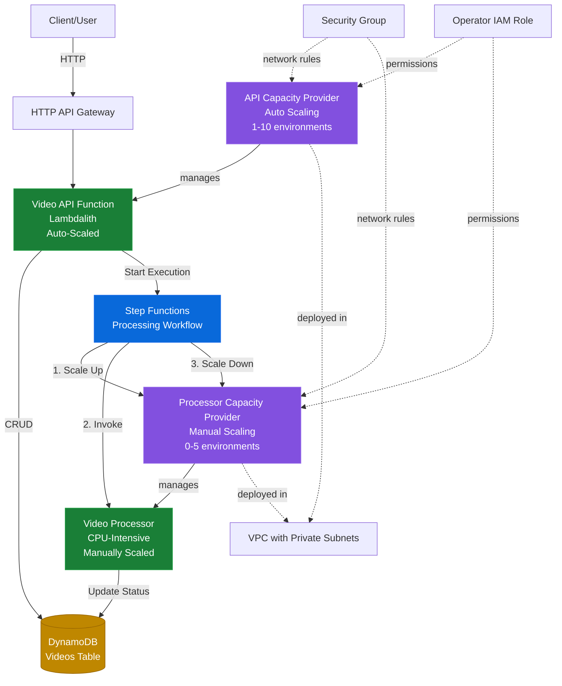

# AWS Lambda Managed Instances - Video Processing Service

## Overview
This AWS CDK stack demonstrates a **real-world video processing service** using AWS Lambda Managed Instances (Lambda MI). It showcases how to build a scalable serverless application with:

- **API Function (Lambdalith)**: Auto-scaled capacity provider handling HTTP requests for video management
- **Background Processor**: Manually-scaled capacity provider for CPU-intensive video processing
- **Step Functions Orchestration**: Dynamic scaling of compute resources for batch processing workloads

## Use Case: Video Processing Platform

Users upload videos via REST API, which stores metadata in DynamoDB. When processing is triggered, a Step Functions workflow:

1. **Scales up** the processor capacity provider (0 → 2-5 environments)
2. **Processes** the video (transcoding, thumbnail generation, AI analysis, subtitles)
3. **Scales down** the capacity provider back to zero to minimize costs

This pattern is ideal for Lambda MI because:
- **Predictable workloads**: Video processing has known resource requirements
- **Cost optimization**: Scale to zero when idle, burst capacity on-demand
- **VPC integration**: Private network access for secure media processing
- **Enhanced compute**: ARM64 with high memory configurations for encoding

## Prerequisites

- Node.js 24.x
- AWS credentials configured
- AWS CDK CLI (`npm install -g aws-cdk`)

## Installation

```bash
npm install
cd functions/video-api && npm install && cd ../..
cd functions/video-processor && npm install && cd ../..
```

## Deployment

```bash
# Creates a new VPC automatically
npx cdk deploy

# Or use an existing VPC
npx cdk deploy -c vpcId=<VPC_ID>
```

After deployment, note the `ApiEndpoint` output for testing.

## Architecture



## API Endpoints

### Video Management (Auto-Scaled API)

```bash
# Health check
GET /health

# Create a new video
POST /videos
{
  "title": "My Video",
  "sourceUrl": "s3://bucket/video.mp4",
  "description": "Optional description"
}

# List all videos
GET /videos

# Filter videos by status
GET /videos?status=completed

# Get specific video
GET /videos/{videoId}

# Trigger video processing
POST /videos/{videoId}/process
```

### Video Processing States
- `uploaded`: Initial state after creation
- `queued`: Processing has been triggered
- `processing`: Currently being processed
- `completed`: Processing finished successfully
- `failed`: Processing encountered an error

## Testing the Service

```bash
# Set your API endpoint
API_ENDPOINT="https://your-api-id.execute-api.region.amazonaws.com"

# Create a video
VIDEO_ID=$(curl -X POST "$API_ENDPOINT/videos" \
  -H "Content-Type: application/json" \
  -d '{
    "title": "Vacation 2024",
    "sourceUrl": "s3://my-bucket/vacation.mp4",
    "description": "Family vacation highlights"
  }' | jq -r '.id')

# Trigger processing (starts Step Functions workflow)
curl -X POST "$API_ENDPOINT/videos/$VIDEO_ID/process"

# Check processing status
curl "$API_ENDPOINT/videos/$VIDEO_ID" | jq .

# List all completed videos
curl "$API_ENDPOINT/videos?status=completed" | jq .
```

## Components

### 1. Video API Function (Lambdalith)
- **Runtime**: Node.js 24.x on ARM64
- **Capacity Provider**: Auto-scaled (1-10 environments)
- **Routes**: 
  - `POST /videos` - Create video
  - `GET /videos` - List videos  
  - `GET /videos/{id}` - Get video
  - `POST /videos/{id}/process` - Trigger processing
  - `GET /health` - Health check
- **Concurrency**: Up to 64 per environment
- **Memory**: 2 GiB per vCPU

### 2. Video Processor Function
- **Runtime**: Node.js 24.x on ARM64
- **Capacity Provider**: Manually-scaled (0-5 environments)
- **Operations**:
  - Thumbnail generation (2s)
  - Video transcoding (8s) - 1080p, 720p, 480p
  - AI content analysis (3s)
  - Subtitle generation (4s)
- **Timeout**: 5 minutes
- **Memory**: 4 GiB per vCPU (high memory for encoding)
- **Concurrency**: Up to 32 per environment

### 3. Scaling Function (Inline Lambda)
- **Runtime**: Node.js 24.x on ARM64
- **Purpose**: Calls `PutFunctionScalingConfig` API to adjust processor scaling
- **Code**: Inline Lambda with AWS SDK v3
- **Why needed**: Step Functions doesn't yet support `PutFunctionScalingConfig` in aws-sdk integration
- **Operations**: Set min/max execution environments dynamically

### 4. Step Functions Workflow
The workflow orchestrates the entire processing pipeline with dynamic scaling:

1. **Scale Up**: Invoke scaling Lambda to set min=2, max=5 environments
2. **Wait**: 30 seconds for execution environments to provision
3. **Process**: Invoke processor function to handle video
4. **Scale Down**: Invoke scaling Lambda to return capacity to min=0, max=0
5. **Error Handling**: Ensures scale-down happens even if processing fails

**Scaling Function**: A simple inline Lambda function calls `PutFunctionScalingConfig` API to dynamically adjust the processor's min/max execution environments. This lightweight wrapper is needed because Step Functions' AWS SDK integration doesn't yet support `PutFunctionScalingConfig` directly.

### 4. DynamoDB Table
- **Partition Key**: `id` (video ID)
- **GSI**: `StatusIndex` (status + createdAt)
- **Billing**: On-demand
- **Fields**: id, title, sourceUrl, status, createdAt, updatedAt, processing results

## Key Features Demonstrated

### Auto-Scaling for API Workloads
The API function uses **automatic scaling** that adjusts based on traffic patterns:
- Min: 1 environment (always ready for requests)
- Max: 10 environments (handles traffic spikes)
- Ideal for unpredictable user-facing workloads

### Manual Scaling for Batch Processing
The processor uses **manual scaling** with programmatic control:
- Starts at 0 (no cost when idle)
- Step Functions scales up before batch processing
- Scales back to 0 after completion
- Ideal for scheduled or event-driven batch jobs

### Cost Optimization Pattern
- API: Minimal baseline (1 env) scales elastically
- Processor: Zero cost when idle, burst capacity on-demand
- High memory configurations (2-4 GiB/vCPU) for media processing

## Cost Considerations

Lambda MI pricing is based on:
- Execution environment hours (not request count)
- vCPU and memory allocation
- Network data transfer

This example optimizes costs by:
- Scaling processor to **zero when not processing**
- Using ARM64 (up to 34% better price/performance)
- Auto-scaling API to match actual traffic
- Processing multiple videos per environment (concurrency)

## Development

```bash
# Build TypeScript
npm run build

# Watch mode
npm run watch

# Lint code
npm run lint

# Format code
npm run format

# Synthesize CloudFormation
npx cdk synth

# View differences
npx cdk diff

# Deploy specific stack
npx cdk deploy LambdaMiStack
```

## Monitoring

View logs in CloudWatch:
- `/aws/lambda/LambdaMiStack-VideoApiFunction*`
- `/aws/lambda/LambdaMiStack-VideoProcessorFunction*`
- `/aws/vendedlogs/states/LambdaMiStack-VideoProcessingStateMachine*`

Monitor capacity provider metrics:
- Active execution environments
- CPU utilization
- Scaling activities

## Clean Up

```bash
npx cdk destroy
```

This will remove all resources including the VPC (if created), DynamoDB table, and logs.
