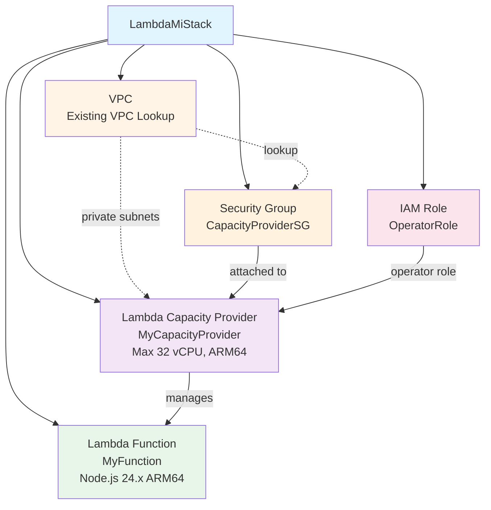

# AWS Lambda Managed Instaces minimal example

## Prequisites

- A VPC with private subnets
- Node.js 24.x
- AWS credentials configured

## Deployment

```bash
npx cdk deploy -c vpcId=<VPC_ID>
```

## Components


