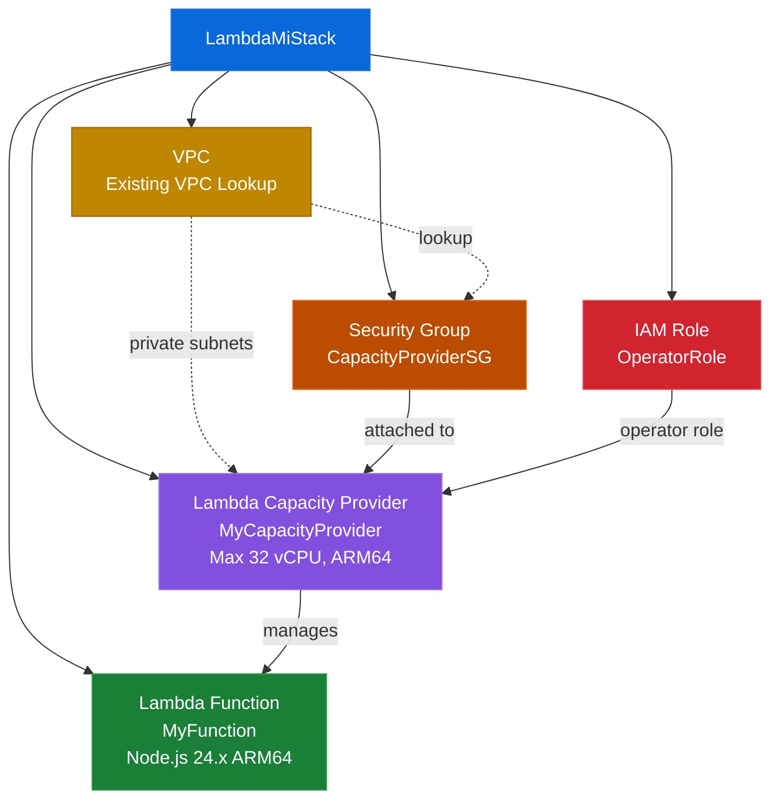

# AWS Lambda Managed Instaces minimal example

## Overview
This AWS CDK stack demonstrates how to set up a Lambda Capacity Provider using AWS Lambda Managed Instances (Lambda MI) to run a Node.js 24.x Lambda function on ARM64 architecture within an existing VPC.

## Prerequisites

- A VPC with private subnets
- Node.js 24.x
- AWS credentials configured

## Deployment

```bash
npx cdk deploy -c vpcId=<VPC_ID>
```

## Components


